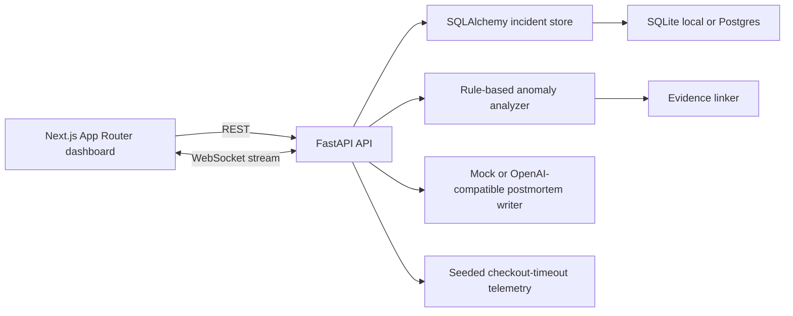

# PulseLens: AI Incident War Room

[](https://github.com/OWNER/REPO/actions/workflows/ci.yml)

PulseLens is a full-stack AI observability demo: it replays a checkout outage, streams OpenTelemetry-shaped logs, traces, and metrics into a war-room dashboard, ranks evidence-cited root-cause hypotheses, and generates a postmortem.

CV bullet:

> Built an AI incident war-room that correlates telemetry, explains root-cause hypotheses with cited evidence, and drafts postmortems from realtime incident streams.

## Architecture



## What The Demo Shows

- Realtime replay of a checkout outage caused by payment-service latency plus retry amplification.
- Correlated timeline across logs, metrics, and traces.
- Ranked root-cause hypotheses with cited evidence for every AI claim.
- Service dependency map and impact summary.
- Exportable postmortem for incident review.

## Quick Start

Backend:

```bash
cd backend
python -m venv .venv
.venv\Scripts\activate
pip install -e ".[dev]"
python -m uvicorn app.main:app --reload --host 127.0.0.1 --port 8000
```

Frontend:

```bash
cd frontend
npm install
npx playwright install chromium
npm run dev
```

Open http://localhost:3000 and click **Start replay**.

Docker option:

```bash
docker compose up --build
```

The local Python workflow uses SQLite automatically. Docker Compose uses Postgres with the pgvector extension enabled.

## Environment

Copy `.env.example` to `.env` for the backend and `.env.local` for the frontend if you want to customize defaults.

- `PULSELENS_AI_MODE=mock` uses deterministic model-free postmortems.
- `PULSELENS_DATABASE_URL` defaults to `sqlite:///./pulselens.db`.
- `PULSELENS_CORS_ORIGINS` controls allowed frontend origins.
- `OPENAI_API_KEY` enables the OpenAI-compatible provider path.
- `OPENAI_BASE_URL` defaults to `https://api.openai.com/v1`.
- `OPENAI_MODEL` defaults to `gpt-4.1-mini`.
- `NEXT_PUBLIC_API_URL` defaults to `http://localhost:8000`.

## Demo Script

1. Start the backend and frontend.
2. Click **Start replay** in the dashboard.
3. Watch service health shift as checkout latency and payment retries rise.
4. Open **Evidence** and filter to `payment-service` to inspect cited telemetry.
5. Open **Services** to explain dependency propagation from payment to checkout.
6. Click **Generate** in **Postmortem** and export the Markdown report.

## Tests

Backend:

```bash
cd backend
python -m pytest
```

Frontend:

```bash
cd frontend
npx tsc --noEmit
npm run build
npm run test:e2e
```

Playwright requires one browser download first:

```bash
npx playwright install chromium
```

On slow networks this download can time out. The app still runs without Playwright; only the browser automation test depends on the downloaded Chromium binary.

## Screenshots

Screenshots are generated into `docs/screenshots/` during visual QA. See [demo capture guide](docs/DEMO_CAPTURE.md).

- `war-room.png`: live incident dashboard with top hypothesis.
- `evidence.png`: cited telemetry explorer filtered to payment-service.
- `services.png`: blast radius and service dependency view.
- `postmortem.png`: generated report preview.

After capturing screenshots, add them to this section:

```md


```

## Portfolio Notes

This project is designed to show production-oriented AI engineering rather than a generic chatbot:

- AI claims are grounded in evidence IDs and degrade to low-confidence states when evidence is thin.
- Generated postmortems include provider, source hypothesis, confidence, and citation coverage metadata.
- The storage layer is durable by default with SQLite and can point at Postgres through `PULSELENS_DATABASE_URL`.
- The backend exposes explicit incident, timeline, analysis, postmortem, and websocket interfaces.
- The UI prioritizes incident workflow: detect, inspect, hypothesize, cite, and write the review.
- The mock AI mode makes the demo reproducible for recruiters without paid API keys.

More docs:

- [Deployment guide](docs/DEPLOYMENT.md)
- [Demo capture guide](docs/DEMO_CAPTURE.md)
- [CV notes](docs/CV.md)
